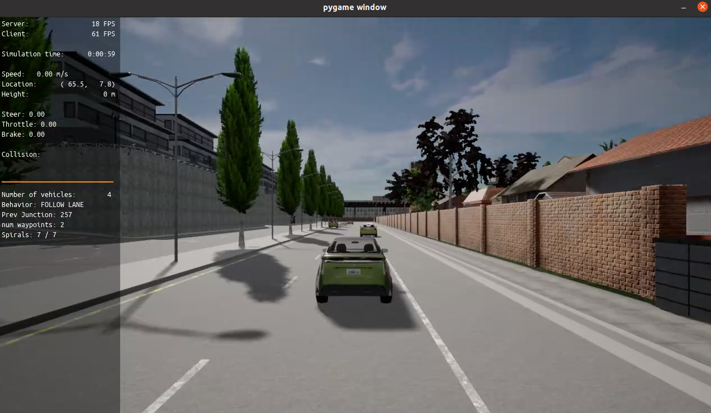
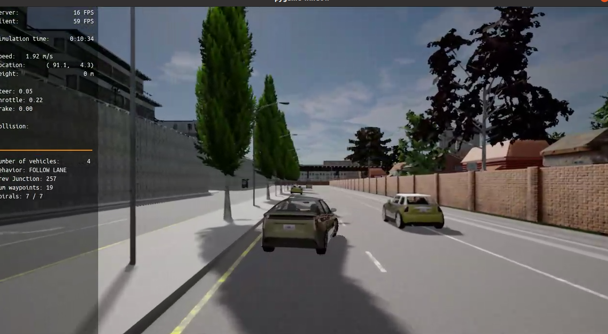
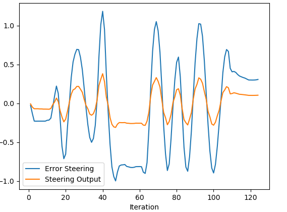
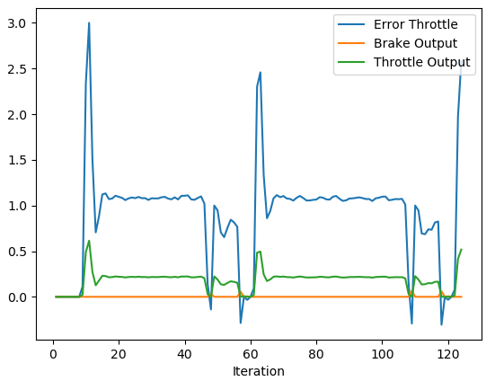

# Final Project

In the image below we can see a frame from the Carla simulator where the car is in the starting position.

In the image below we can see the overtaking manoeuver.

## Steering Control

The plot below shows the steering tracking error as well as the associated controller output. We can see that the controller nicely tracks the errors even though it does so in a weaker manner. We again can see a nice tracking as we don't see any large overshoots which means that our parameters are well tuned.

## Throttle Control

In the image below we can see the throttle error as well as the resulting output from the throttle controller. We again can see a nice tracking as we don't see any large overshoots which means that our parameters are well tuned. We also don't see any significant oscillations which indicates that we chose the damping parameters well.

We could implement the twiddle algorithm and run the simulation a couple of times to converge on a locally optimal solution.
Model free controllers can be implemented without knowledge of the dynamics of the system. They are also very simple controllers
On the other hand they have an inherent time delay to them as they are dependent on feedback from the sensors.